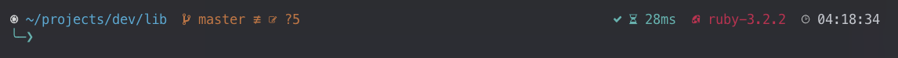

# Brilliant Theme for Oh-My-Posh

Dark themes for [Oh-My-Posh](https://github.com/JanDeDobbeleer/oh-my-posh) terminal prompt with slim and tile versions available for choosing.

Detects versions for:

1. CMake
2. Go
3. Node.js
4. Python
5. Ruby
6. Rust

## Preview

### Brilliant Slim

Normal version shown above.

### Brilliant Tiles

Warp version shown above. Notice the arrow is absent for this terminal.

## Install

1. Download the `.json` theme file(s) to your local theme directory
2. Update Oh-My-Posh commands in your shell profile to use one (see [official documentation](https://ohmyposh.dev/docs/installation/customize) for details)
3. Enjoy!

## Limitations

Due to the nature of how [Warp](https://www.warp.dev/) handles custom prompts, this terminal has its own custom theme files. They are missing decorators for the second prompt line since they are not properly implementable.
